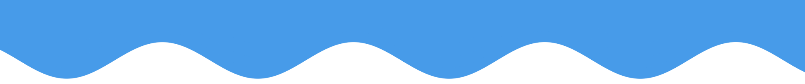

<em>At least once</em>

  <h2><strong>TECH👨‍💻</strong></h2>

  &nbsp;
  &nbsp;
  &nbsp;
  &nbsp;
  &nbsp;
  &nbsp;
  &nbsp;
  &nbsp;
  &nbsp;
  &nbsp;
  &nbsp;
  &nbsp;
  &nbsp;
  &nbsp;
  &nbsp;
  &nbsp;
  &nbsp;
  &nbsp;
  &nbsp;

<h3><strong>About Me💁‍♂️</strong></h3>

✨ interesting - interaction, db 
💗 happiness - camping, webtoon, eating 
✍ learning - canvas 2D, Golang 
📚 currently reading a 'Mastering Ethereum' 

<h3><strong>Contact📌</strong></h3>
&nbsp;

